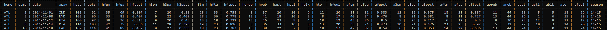
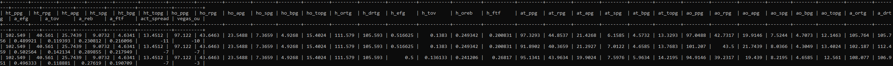

# Machine Learning to Predict NBA Point Spreads
#### Ryan Won CS613
## Directory and File Description
The directory contains a multitude of scripts that are placed in three sub-directories.
* **data_collection** - This subdirectory deals with scripts responsbile for collecting or scraping data.
  * **spreadWebscraper.py** - Script that utilizes Selenium and Beautiful Soup to scrape betting data from all NBA games 
  within 2014-2018. Creates the *bettingdata* SQL table.
* **data_processing** - This subdirectory deals with scripts that manipulate existing data or creates new data. These 
scripts all use and connect to a SQL database.
  * **addSeasonColumn.py** - Short script that adds the season number (ex. 14-15) to a row of data in the *boxscores* 
  SQL table. This does not automatically add the column to the table - an empty column called 'season' must be added to 
  the table first.
  * **createSeasonStats.py** - This script takes the data from the *boxscores* SQL table (which must have had 
  **addSeasonColumn.py** run first) and creates a new table called *seasonstats*, which has each teams stats for a specific 
  season.
  * **createGameData.py** - This script creates the training data, composed of home team's season stats, home team's 
  recent four factor stats, away team's season stats, and away team's recent four factor stats. For this specific script, 
  the season stats contain the stats of the team averages and their opponents averages, and the stats are the averages 
  from the entire season. Creates table called *gamedata*.
  * **createRollingGameData.py** - This script serves the same purpose as **createGameData.py**, but creates a table called 
  *rollinggamedata* which instead calculates the home team's season stats and away team's season stats on a rolling 
  basis, or cumulative season stats up until the game that is played. 
* **data_analysis** - This subdirectory contains scripts that focus on regression models and feature analysis. While both 
regression scripts can run on either seasonal average game dataset or the rolling game dataset, all of the shown results
are from the rolling game dataset, as it is closer to modeling the prediction of real life games.
  * **runLinearRegression.py** - Runs a basic linear regression model with S-Folds cross validation, with option to run
  on either seasonal average game data set or rolling game data set.
  * **runKnnRegression.py** - Runs a K-NearestNeighbors regression algorithm on the data. The optimal k-value is determined
  through the usage of GridsearchCV, and this can be run on either the seasonal average game data set or rolling game 
  data set.
  * **createLOFOImportance.py** - Runs F-Test and Mutual Importance feature testing on a given dataset. The given dataset
  (either rolling or average) must be exported to a csv first to be imported into this script.
  * **createExampleFigures.py** - This script creates graphs of the four factors over a season for a given team for a 
  given season. 
  * **createSpreadFigures.py** - Creates a simple plot of the vegas data vs the actual data as well as predicted data
  vs the vegas data.
## Database Setup
This project utilizes MySQL for database management tooling. The project contains the following five tables.
* *bettingdata* - This table is created by the **spreadWebscraper.py** script. Each row in this table represents a game 
played between 2014-2018. Each row contains information regarding home and away teams, date, home spread, away spread,
and over/under.
* *boxscores* - This table is created by the **createSeasonStats.py** script. Each row in this table is representative of
a game played between 2014-2018(a boxscore for a game). The following image shows the columns in this table, along with
a few rows of data as example of what data should be. h stands for Home and a stands for Away in the column headers.

* *gamedata* - This table is the data that is intended for use in regression models concerning seasonal average data. Each
row of this table is representative of a game played between 2014-2018, although there are no identifying data such as 
team or date. The image shows the columns in this table below table *rollinggamedata*. Columns are defined in the description
for *rollinggamedata*. 
* *rollinggamedata* - This table contains column headers that are identical to the *gamedata* table. The data inside this
table, however, is calculated with rolling season statistics. h_ stands for Home, a_stands for away, ht_ stands for 
home team's stats, ho_ stands for home opponent's stats, at_ stands for away team's stats, and ao_ stands for away opponent's
stats.

## Library Requirements
Many different libraries and packages are required to be able to run the various scripts in this repository. They are listed 
in order of the listed files from above.
* **Data Collection**
  * selenium - allows navigation of web page during scraping
  * bs4 - parses html page source
  * tqdm - for loading bar and progress of script
  * mysql - to write scraped data to mysql database
* **Data Processing**
  * mysql - to read, write, edit tables in mysql database
  * tqdm - for loading bar and progress of script
* **Data Analysis**
  * mysql - to read in data from mysql database tables
  * numpy - to store table data
  * sklearn - for utilization of various machine learning tools and models
  * matplotlib - for graping and data display
  * plotly - for graphing and data display
## How to Run
#### Data Collection
First, run the **spreadWebscraper.py** script to retrieve the betting data. (NOTE: Currently, the website that betting data
is scraped from has changed the way date is accessed from a date picker to a calendar. As such, the webscraper will no
longer function correctly to grab all betting data from the site.) This will create the *bettingdata* table in SQL. Then,
create a table based on the nba.games.stats.csv file, which was taken from Kaggle. Name this table *boxscores*. Double 
check with a text editor that the date is stored in format yyyy-mm-dd. Opening this file in Excel and saving will change
the date format to the default Excel date format which is incompatible with the SQL date format.
#### Data Processing
 Before running the **addSeasonColumn.py** script, you need an empty season column to the *boxscores* table for easier
 data processing later down the line. You can do so with the following command: "ALTER TABLE boxscores ADD season 
 VARCHAR(255);". After adding the column, you can run the script which will populate the season column with each games 
 respective season. Then, run the **createSeasonStats.py** script, which will create the table *seasonstats*. Finally, 
 run the **createGameData.py** and **createRollingGameData.py** scripts to create the *gamedata* and *rollinggamedata*
 tables. For usage in the feature selection and data analysis scripts, export both of these table to csv files, named
 export_gamedata.csv and export_rollinggamedata.csv respectively.
 #### Data Analysis
 All the scripts can be run independently of each other, as long as all the steps in the Data Collection and Data
 Processing have been followed. When running **runLinearRegression.py**, uncomment the line in retrieve_mysql_data to
 switch between running regression on the seasonal data and running average data. You can do the same thing when
 running **runKnnRegression.py**. When running **createExampleFigures.py**, it is by default set to statistics from
 the Philadelphia 76ers for the 2017-2018 season, but these parameters can be changed in the main class. Running
 **createLOFOImportance.py** has two different functionality. The first is to create a plot of all the data with its 
 MI and FTest numbers. The second, by default commented out, is to created bar charts of the MI and FTest numbers.